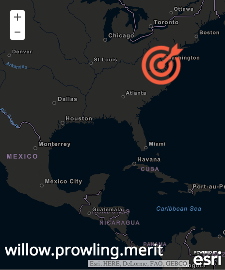
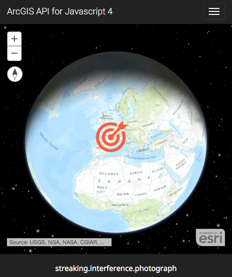
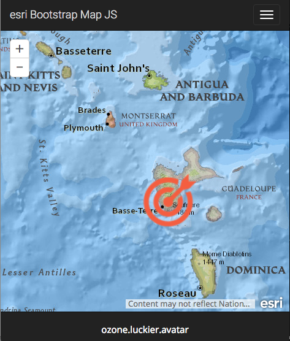

# arcgis-javascript-samples
These applications demonstrate reverse geocoding with [what3words](//what3words.com)  using [ArcGIS API for JavaScript](//js.arcgis.com).

Click on screenshots to view it live.

#### ArcGIS API 3.15 using vector tile layer

#### ArcGIS API 4.0 beta 3

#### Bootstrap-map-js and ArcGIS API 3.15

### Resources
* [what3words](//what3words.com)
* [@what3words](//twitter.com/what3words)
* [ArcGIS API for JavaScript](//js.arcgis.com)
* [Bootstrap-map-js](http://esri.github.io/bootstrap-map-js/demo/index.html)
* [JQuery](//jquery.com)
* [Bootstrap](//getbootstrap.com)
* [Font-Awesome](fortawesome.github.io/Font-Awesome/)

### Issues
Find a bug or want to request a new feature? Please let us know by submitting an issue.

### Contributing
Anyone and everyone is welcome to contribute.

### Licensing
The MIT License (MIT)

A copy of the license is available in the repository's [license](LICENSE) file.
